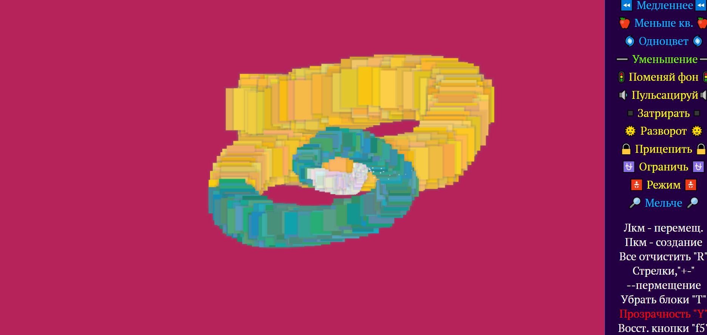
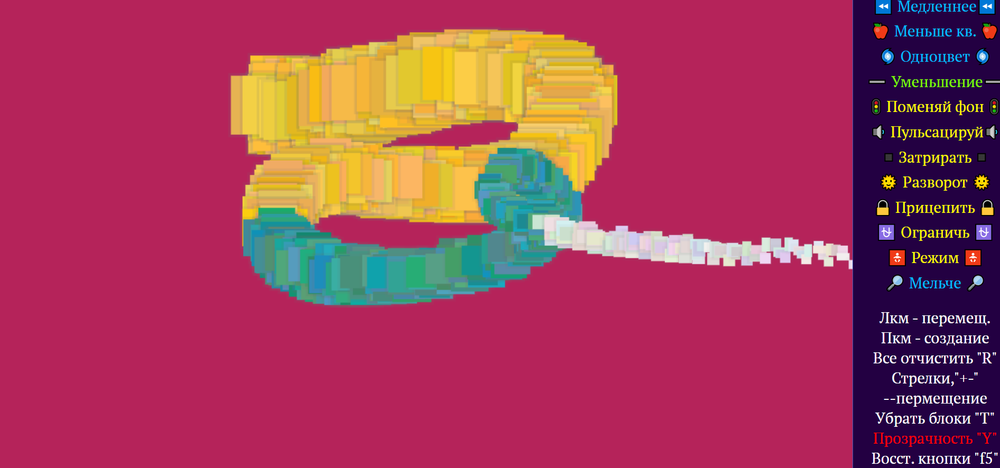
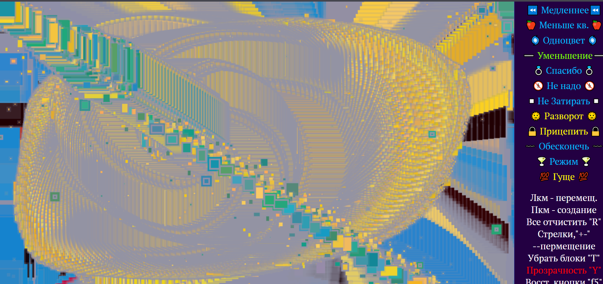
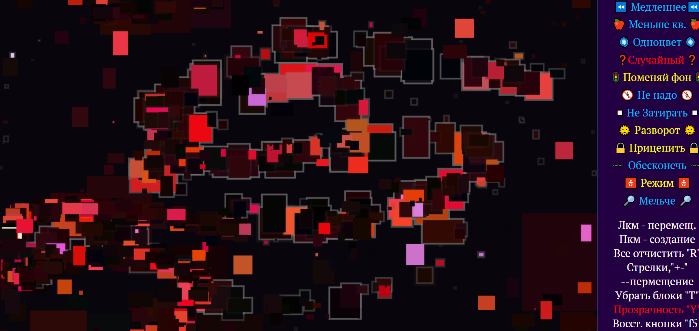

Программа на  js, которая иммитирует трехмерную графику за счёт перспективы.

_____

## Установка

Скачать архив, запустить World.html

_______

## Пояснение

Создание обьектов на правую клавишу, перемещение на левую. Так же есть опции, которые можно запускать нажимая по ним или на клавишах 1-9. 

__
Тут мы создали что-то наподобии кальмара

И повернули его на небольшой угол

Поигравшись с найтроками можно добиться необычных картин 

